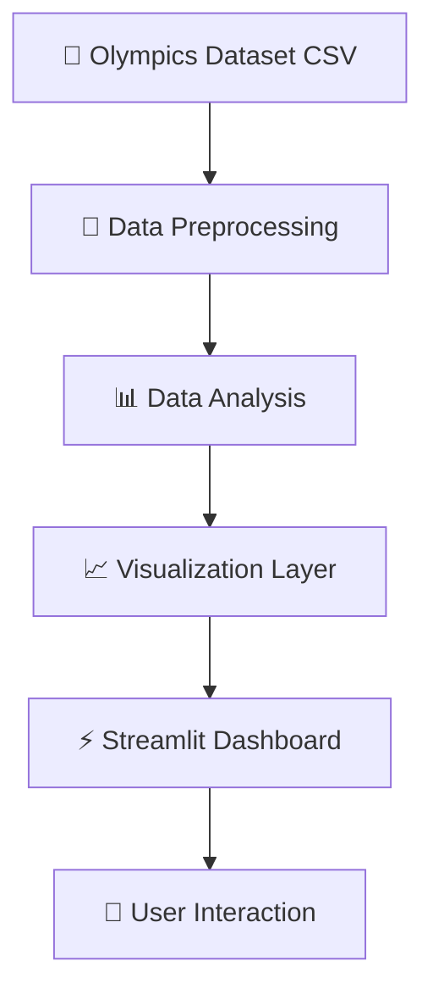

<div align="center">


<br><br>


<br><br>

<p align="center">


</p>

<br>

<h2>🏆 Discover Insights Hidden Inside Olympic History 🏆</h2>

<p align="center">
A powerful data analytics and visualization project that explores over 120 years of Olympic history using Python, Streamlit, and interactive dashboards.
</p>

</div>

---

# 📌 Project Overview

## 🏅 Olympics Dataset Analysis

This project performs an in-depth analysis of Olympic datasets to uncover meaningful insights, trends, medal distributions, athlete statistics, and country-wise performance over the years.

The application provides:

- 📊 Interactive data visualizations
- 🌍 Country-wise Olympic analysis
- 🏅 Medal tally exploration
- 👨‍🎓 Athlete performance insights
- 📈 Trend analysis across Olympic history
- ⚡ Dynamic filtering and dashboards

Olympic data analysis projects commonly use Python visualization libraries and Streamlit dashboards to analyze athlete performance, medal counts, and historical trends. :contentReference[oaicite:0]{index=0}

---

# ✨ Major Features

<div align="center">

| 🚀 Feature | 📌 Description |
|---|---|
| 🏅 Medal Tally Analysis | Analyze medals by country and year |
| 🌍 Country-Wise Insights | Compare country performances |
| 📈 Trend Visualization | Olympic growth over decades |
| 👨‍🎓 Athlete Analysis | Explore athlete statistics |
| 🔥 Heatmaps | Sports participation analysis |
| 📊 Interactive Charts | Dynamic visual dashboards |
| ⚡ Streamlit Interface | Fast and interactive UI |
| 🔍 Data Filtering | Explore customized insights |

</div>

---

# 🧠 Analysis Modules

## 📊 Overall Analysis
- Participating nations over the years
- Growth of Olympic events
- Athlete participation trends
- Most successful athletes

## 🌍 Country-Wise Analysis
- Medal tally by country
- Country sports dominance
- Historical performance analysis

## 👨‍🎓 Athlete Analysis
- Age distribution
- Gender participation trends
- Athlete performance visualization

Olympic analysis dashboards often include medal tally tracking, country analysis, athlete demographics, and interactive charts. :contentReference[oaicite:1]{index=1}

---

# ⚙️ Technologies Used

<div align="center">

<table>

<tr>

<td align="center" width="180">
<br>
<b>Python</b>
</td>

<td align="center" width="180">
<br>
<b>Streamlit</b>
</td>

<td align="center" width="180">
<br>
<b>GitHub</b>
</td>

<td align="center" width="180">
<br>
<b>VS Code</b>
</td>

</tr>

</table>

</div>

---

# 📚 Python Libraries

<div align="center">

| 📦 Library | 🚀 Purpose |
|---|---|
| Pandas | Data preprocessing |
| NumPy | Numerical operations |
| Matplotlib | Static visualizations |
| Seaborn | Statistical plotting |
| Plotly | Interactive charts |
| Streamlit | Web dashboard |

</div>

Python data analysis projects commonly rely on Pandas, Matplotlib, Seaborn, Plotly, and Streamlit for preprocessing and interactive visualization workflows. :contentReference[oaicite:2]{index=2}

---

# 🧩 System Architecture



---

# 📸 Dashboard Preview

<div align="center">


</div>

---

# 📂 Project Structure

```bash
📦 Olympics-Dataset-Analysis
 ┣ 📂 dataset
 ┣ 📂 notebooks
 ┣ 📂 images
 ┣ 📜 app.py
 ┣ 📜 helper.py
 ┣ 📜 preprocessor.py
 ┣ 📜 requirements.txt
 ┣ 📜 README.md
 ┗ 📜 olympics.ipynb
```

---

# ⚡ Installation & Setup

## 📥 Clone Repository

```bash
git clone https://github.com/Nksnaveenks/Olympics-Dataset-Analysis-.git
```

---

## 📂 Navigate To Project

```bash
cd Olympics-Dataset-Analysis-
```

---

## 📦 Install Dependencies

```bash
pip install -r requirements.txt
```

---

## ▶️ Run Streamlit Application

```bash
streamlit run app.py
```

Streamlit is commonly used for building interactive Python-based analytics dashboards and visualization applications. :contentReference[oaicite:3]{index=3}

---

# 📈 Types Of Visualizations

<div align="center">

| 📊 Visualization | 🎯 Purpose |
|---|---|
| Line Charts | Trends over years |
| Bar Charts | Medal comparisons |
| Scatter Plots | Athlete performance |
| Heatmaps | Sports participation |
| Pie Charts | Distribution analysis |
| Interactive Graphs | User-driven exploration |

</div>

Visualization techniques such as heatmaps, scatter plots, bar charts, and interactive dashboards are commonly used in Olympic data analytics projects. :contentReference[oaicite:4]{index=4}

---

# 🎯 Project Objectives

✅ Analyze Olympic history data  
✅ Visualize global sports trends  
✅ Understand athlete performance  
✅ Explore country-wise achievements  
✅ Build interactive analytics dashboards  
✅ Learn real-world data visualization  

---

# 🌟 Future Improvements

- 🤖 Machine learning predictions
- 🌍 Live Olympics integration
- 📱 Mobile responsive dashboard
- ☁️ Cloud deployment
- 📊 AI-powered recommendations
- 🏅 Predict future medal tallies
- 📈 Advanced sports analytics

---

# 📖 Learning Outcomes

<div align="center">

| 📘 Concept | 🚀 Skills Gained |
|---|---|
| Data Cleaning | Preprocessing large datasets |
| EDA | Exploratory Data Analysis |
| Dashboard Development | Streamlit web apps |
| Visualization | Interactive plotting |
| Analytics | Trend discovery |

</div>

---

# 🤝 Contribution Guide

Contributions are welcome!

## 📌 Steps To Contribute

### 1️⃣ Fork Repository

### 2️⃣ Clone Repository

```bash
git clone https://github.com/your-username/Olympics-Dataset-Analysis-.git
```

### 3️⃣ Create New Branch

```bash
git checkout -b feature-name
```

### 4️⃣ Commit Changes

```bash
git commit -m "Added new feature"
```

### 5️⃣ Push Changes

```bash
git push origin feature-name
```

### 6️⃣ Open Pull Request 🚀

---

# 🛡️ License

Licensed under the **MIT License**.

---

# 👨‍💻 Developer

<div align="center">


# 🚀 Naveen K S

### Associate Software Engineer @ Accenture

<br>

<a href="https://github.com/Nksnaveenks">

</a>

<a href="https://linkedin.com">

</a>

</div>

---

# 💭 Inspiration

> “Data tells the story behind every Olympic victory.”

---

<div align="center">


# ⭐ Star This Repository If You Like The Project ⭐

</div>
